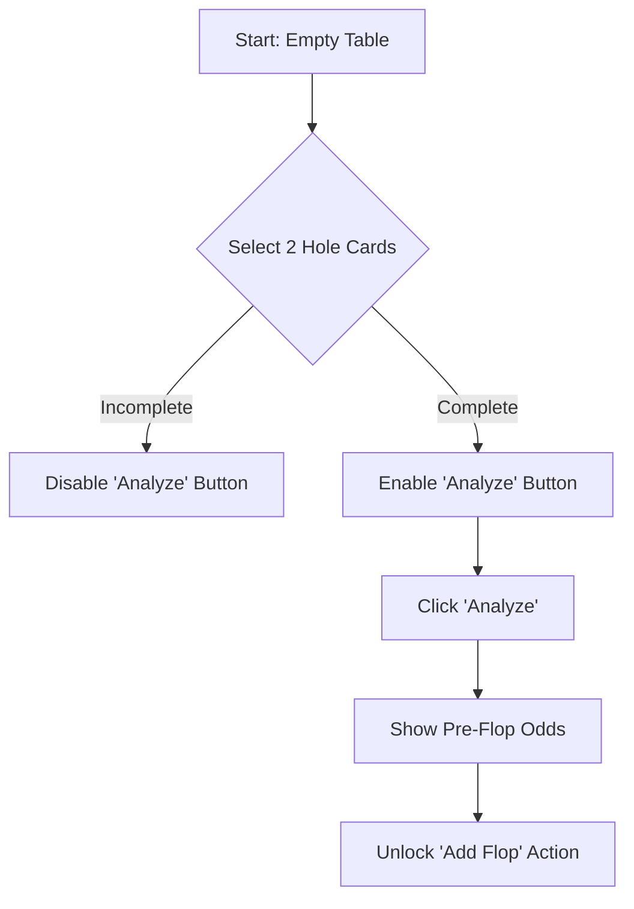
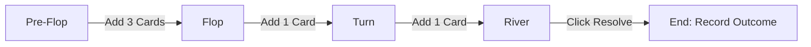

# Poker UI User Flows & Business Rules

This document serves as the definitive reference for the RDR2 Poker Assistant web interface. It outlines the state machine, card entry requirements, and the logic governing transitions between game stages.

## 1. Core Business Rules (RDR2 Logic)

### 1.1. Hand Validity Constraints
*   **Player Hand:** Exactly **2 cards** must be selected before any analysis can begin.
*   **Community Cards:** Supported counts are **0 (Pre-flop), 3 (Flop), 4 (Turn), or 5 (River)**.
*   **Deck Integrity:** The UI must prevent the same card (Rank + Suit) from being assigned to multiple slots.

### 1.2. Progressive Game Stages
Analysis is triggered as the game moves through these specific RDR2 stages:

| Stage | Player Cards | Community Cards | Requirement |
| :--- | :--- | :--- | :--- |
| **Pre-Flop** | 2 | 0 | Minimum entry to start. |
| **Flop** | 2 | 3 | UI must force exactly 3 new cards. |
| **Turn** | 2 | 4 | UI must force exactly 1 new card. |
| **River** | 2 | 5 | UI must force exactly 1 new card. |

## 2. User Flow: The Gambling Loop

### 2.1. Initial Hand Entry (Pre-Flop)
The user enters the "Interaction Forge" to start a new hand.

### 2.2. Progressive Advancement (Flop -> Turn -> River)
As cards are dealt in RDR2, the user updates the tool. To maintain "Omniscient NPC" tracking, the UI should lock previous cards and only allow adding to the next stage.

## 3. UI State Transitions & Logic

### 3.1. "The Lock Mechanism"
To prevent accidental UI resets and maintain telemetry (History Service) integrity:
*   **Locked State:** Once "Analyze" is clicked for a stage, the hole cards and existing community cards should become "read-only" (grayed out or stylized as fixed on the table).
*   **Edit Mode:** If a mistake is made, a "Correct Hand" button allows unlocking, but warns that it will invalidate the current telemetry trace.

### 3.2. Error Handling & Validation
*   **Incomplete Community:** If a user adds 1 or 2 cards in the Flop stage, the UI shows a "Waiting for Flop..." hint and keeps the Analyze button disabled.
*   **Over-selection:** The UI automatically moves the "Focus" to the next available slot once a card is selected.

## 4. Telemetry Integration (Silent Recorder)
*   **Analysis Step:** Every click of "Analyze" triggers a `POST /api/poker/analyze` with `record: true`.
*   **The Resolution Step:** Once the River is reached (or the player folds), the UI must present the **"Resolve Outcome"** prompt.
    *   Options: **WIN, LOSS, FOLD**.
    *   Input: **Chips Won/Lost**.
    *   Effect: Clears the table and marks the Round ID as closed in the database.
