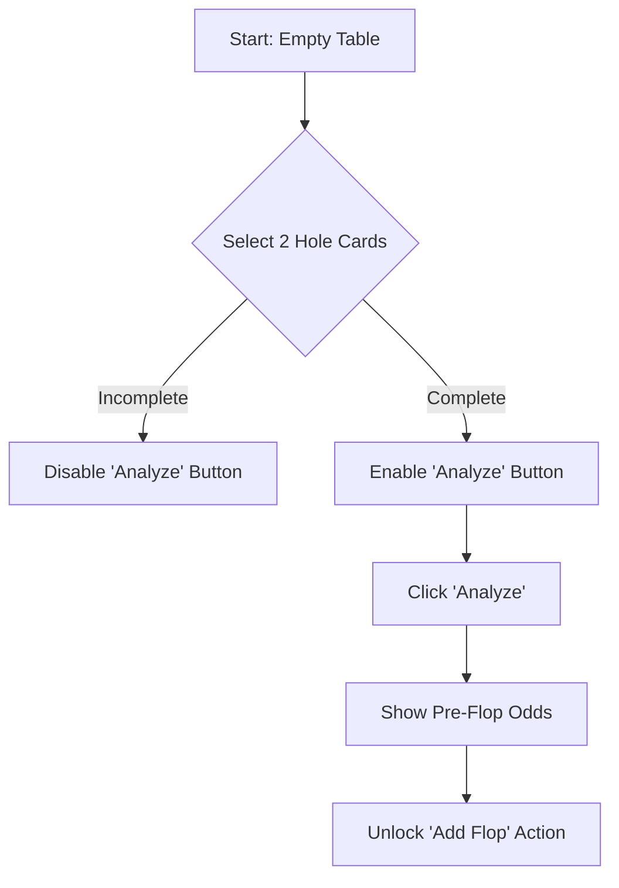
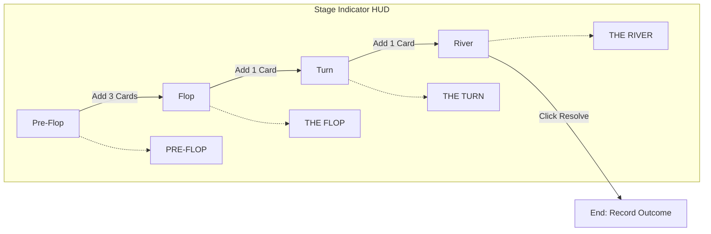

# Poker UI User Flows & Business Rules

This document serves as the definitive reference for the RDR2 Poker Assistant web interface. It outlines the state machine, card entry requirements, and the logic governing transitions between game stages.

## 1. Core Business Rules (RDR2 Logic)

### 1.1. Hand Validity Constraints
*   **Player Hand:** Exactly **2 cards** must be selected before any analysis can begin.
*   **Community Cards:** Supported counts are **0 (Pre-flop), 3 (Flop), 4 (Turn), or 5 (River)**.
*   **Deck Integrity:** The UI must prevent the same card (Rank + Suit) from being assigned to multiple slots.

### 1.2. Progressive Game Stages
Analysis is triggered as the game moves through these specific RDR2 stages:

| Stage | Player Cards | Community Cards | Requirement |
| :--- | :--- | :--- | :--- |
| **Pre-Flop** | 2 | 0 | Minimum entry to start. |
| **Flop** | 2 | 3 | UI must force exactly 3 new cards. |
| **Turn** | 2 | 4 | UI must force exactly 1 new card. |
| **River** | 2 | 5 | UI must force exactly 1 new card. |

## 1.3. Terminology: Stages vs. Actions
It is critical to distinguish between what happens **on the table** (Stages) and what the **player does** (Actions).

### Game Stages (Automatic by Card Count)
The user does not "click a Flop button". Instead, the UI provides card slots. When the required number of cards is entered, the tool recognizes the stage via a **Game Stage Indicator**:
*   **The Flop:** The moment 3 cards are dealt to the center.
*   **The Turn:** The moment a 4th card is dealt.
*   **The River:** The moment the 5th and final card is dealt.

### Player Actions (User Input)
These are decisions the player makes based on the tool's advice. Only one action needs a specific UI button in our tool:
*   **Fold:** The player chooses to give up the hand. In the UI, this is a **Resolution Action** that ends the current round recording and clears the table.
*   **Bet/Call/Check:** These are in-game actions that don't require specific buttons in our tool (as they are part of the game progression), but the resulting outcome (Win/Loss) will be recorded at the end.

## 2. User Flow: The Gambling Loop

### 2.1. Initial Hand Entry (Pre-Flop)
The user enters the "Interaction Forge" to start a new hand.

### 2.2. Progressive Advancement (Flop -> Turn -> River)
As cards are dealt in RDR2, the user updates the tool. To maintain "Omniscient NPC" tracking, the UI should lock previous cards and only allow adding to the next stage.

## 3. UI State Transitions & Logic

### 3.1. "The Lock Mechanism"
To prevent accidental UI resets and maintain telemetry (History Service) integrity:
*   **Locked State:** Once "Analyze" is clicked for a stage, the hole cards and existing community cards should become "read-only" (grayed out or stylized as fixed on the table).
*   **Edit Mode:** If a mistake is made, a "Correct Hand" button allows unlocking, but warns that it will invalidate the current telemetry trace.

### 3.2. Error Handling & Validation
*   **Incomplete Community:** If a user adds 1 or 2 cards in the Flop stage, the UI shows a "Waiting for Flop..." hint and keeps the Analyze button disabled.
*   **Over-selection:** The UI automatically moves the "Focus" to the next available slot once a card is selected.

### 3.3. Game Stage Indicator
To keep the user grounded in the "Omniscient NPC" logic, a dedicated **Stage Indicator** HUD element will track the progression.

| State | Condition | Visual Feedback |
| :--- | :--- | :--- |
| **AWAITING** | < 2 Hole Cards | Dimmed, "Waiting for Player Cards..." |
| **PRE-FLOP** | 2 Hole + 0 Comm | High Contrast, Red/Gold accent. |
| **THE FLOP** | 2 Hole + 3 Comm | HUD text updates to "THE FLOP". |
| **THE TURN** | 2 Hole + 4 Comm | HUD text updates to "THE TURN". |
| **THE RIVER** | 2 Hole + 5 Comm | HUD text updates to "THE RIVER". |

**Visual Style:** Following the RDR2 HUD, this should be a condensed, uppercase label (using `$font-hud-condensed`) positioned near the Card Slots or atop the Interaction Forge.

### 3.4. Behavioral Rules for the "Fold" Action
The "Fold" button is a critical exit path for the user. To ensure data integrity and prevent logical errors (e.g., folding a hand that doesn't exist), the following rules apply:

*   **API Support:** The existing `POST /api/history/resolve` endpoint natively supports `outcome: "fold"`. No additional poker-logic changes are required as folding is a terminal state, not a mathematical one.
*   **Legal State:** The "Fold" button is **Disabled** by default. It only becomes **Interactable** once the `round_id` is established (i.e., after the first "Analyze" call at the Pre-Flop stage).
*   **Continuity:** Once enabled, the "Fold" button remains visible and interactable through the Flop, Turn, and River stages, allowing the user to exit the hand at any point of the game's progression.
*   **Termination Logic:** Clicking "Fold" triggers an immediate resolution. The UI must:
    1.  Call the Resolve API with `outcome: "fold"`.
    2.  Disable all further card selection for the current table.
    3.  Flash a "Hand Folded" message in the Stage Indicator.
    4.  Reset the UI to the "Awaiting" state after a short delay (clean sweep).

## 4. Telemetry Integration (Silent Recorder)
*   **Analysis Step:** Every click of "Analyze" triggers a `POST /api/poker/analyze` with `record: true`.
*   **The Resolution Step:** Once a hand concludes (either at the River or earlier via a Fold), the UI must present the **Resolution Panel**.

### Resolution UI Elements
| Element | Logic | API Action |
| :--- | :--- | :--- |
| **"I Won" Button** | Captures chips won. | `resolve_round(outcome='win')` |
| **"I Lost" Button** | Captures chips lost. | `resolve_round(outcome='loss')` |
| **"I Folded" Button** | Ends hand immediately. | `resolve_round(outcome='fold')` |
| **Chip Input** | Optional numeric field for profit/loss. | Passed as `net_chips` |

## 5. Restructured UI: The Central Deck & Drag-Drop Interaction

To provide a more tactile and immersive experience, the card selection is moving from static menus to a **Central Deck** interaction model.

### 5.1. The Unified Central Deck
*   **Concept:** A single visual representation of a 52-card deck available in the "Interaction Forge".
*   **Availability Logic:** Any card currently present on the "Game Table" (Hole or Community) is automatically **Disabled** in the Central Deck.
*   **Visual Feedback:** Disabled cards should appear "de-saturated" or "transparent," indicating they are physically removed from the dealer's hand.

### 5.2. Drag-and-Drop Interaction
*   **Source:** The Central Deck.
*   **Targets:** 
    *   **Hole Section:** (2 slots)
    *   **Community Section:** (3 Flop slots, 1 Turn slot, 1 River slot)
*   **Behavior:** Users drag a card from the deck and drop it into a specific slot on the table.

### 5.3. Required Slot Enforcement (Red Opacity)
To guide the user through the RDR2 game progression, placeholders on the board will use color-coded opacity:

| Slot State | Logic | Visual Feedback |
| :--- | :--- | :--- |
| **Required** | A slot that *must* be filled to reach the next "Analyze" threshold. | **Red Opacity (40%)** |
| **Future** | A slot that is not yet reachable (e.g., the Turn slot during Pre-Flop). | **Standard Dimmed/Empty** |
| **Filled** | A card has been dropped into the slot. | **Solid Card Render** |

**Example:** 
*   In the **Awaiting** stage, both Hole Card slots glow with **Red Opacity**.
*   Once the Hole cards are filled and analyzed (entering **Pre-Flop**), the 3 Flop slots switch to **Red Opacity**.

### 5.4. Sync with Game Progression
The "Red Opacity" highlights are strictly driven by the **Game Stage Indicator** (Section 3.3). This ensures the UI enforcement perfectly matches the business logic of the Poker API.

1.  **Stage: Awaiting** → Highlight Hole [1, 2]
2.  **Stage: Pre-Flop** → Highlight Flop [1, 2, 3]
3.  **Stage: The Flop** → Highlight Turn [1]
4.  **Stage: The Turn** → Highlight River [1]
5.  **Stage: The River** → All slots filled; Focus shifts to **Resolution Panel**.
